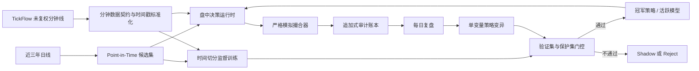

# AI 投资专家 Agent

AI 投资专家是一个仅用于模拟盘的分钟级 Agent。它在每个交易日使用上一交易日及更早的数据选择候选，在盘中只读取已经完成的 TickFlow 1 分钟 K 线，并在收盘后基于可审计结果进行训练或策略进化。

> 本模块不包含实盘券商接口，也不会发送真实委托。任何模型或进化策略都不能修改风控宪法。

## 架构



主要实现位置：

- `backend/app/paper_agent/`：数据集、训练、运行时、撮合、进化与 SQLite 审计存储。
- `backend/app/services/investment_expert.py`：交易日生命周期和低人工干预调度。
- `backend/app/api/investment_expert.py`：管理 API。
- `frontend/src/pages/InvestmentExpert.tsx`：运行、数据、训练和进化控制台。

## 防作弊与成交契约

系统采用 fail-closed 语义：无法证明数据当时已经可用时，不交易。

1. 候选集在日期 `T` 收盘后计算，只能从下一个已观察交易日开始使用，始终满足 `source_date < trade_date`。
2. 分钟 K 线的时间戳代表该分钟开始时间；特征要到 `bar_time + 1 minute` 才可用。
3. 信号不能在本分钟成交。撮合价为下一条合法分钟线的未复权 `raw_open`，并施加不利方向滑点。
4. 迟到超过 90 秒、乱序、不完整或缺失的分钟线被拒绝，不补价、不插值、不回放补买。
5. 强制 A 股 T+1、100 股整手、佣金最低收费、卖出印花税、成交量参与率、仓位和总敞口限制。
6. 一字涨停不买，一字跌停或停牌不卖；无法成交的卖单保持阻塞状态，绝不假设成交。
7. 特征快照、决策、订单事件、组合快照、策略版本、模型版本及晋升/回滚事件均持久化。

## 三年样本与训练

在「AI 投资专家」页面点击“构建三年样本”后，后台会：

1. 检查本地日线覆盖范围；能力允许时通过 TickFlow 向前补齐所需日线。
2. 为每个交易日生成 Point-in-Time 候选，使用 20 日动量、成交额排名，并在实时候选中融合现有趋势/突破/量价策略的一致性得分。
3. 按日下载候选股未复权分钟线。日期 `T` 的分钟分区还包含 `T-1` 候选，以支持合法的跨日卖出与 T+1 标签。
4. 按日期分区写入 Parquet；已完成分区会跳过，因此任务可断点续跑。
5. 构造固定决策截点样本：特征截至 10:01 可用，下一分钟开盘模拟买入，下一交易日 09:31 分钟开盘模拟卖出，并扣除费用和滑点。
6. 按交易日期做 70%/15%/15% 的训练、验证、保护集切分。模型只使用训练集拟合标准化参数。
7. 只有验证集和保护集的 Brier 分数、样本量及扣费后入选期望同时通过门控，模型才会晋升；否则保留为未启用版本。

训练模型是入场概率门控器：它只能否决规则策略给出的买入，不能越权买入、扩大仓位或改变成交规则。没有通过门控的模型时，系统自动使用规则基线。

训练文件默认位于：

```text
<data_dir>/user_data/investment_expert/training/
  manifest.json
  candidates/date=YYYY-MM-DD/part.parquet
  minute/date=YYYY-MM-DD/part.parquet
```

审计数据库默认位于：

```text
<data_dir>/user_data/investment_expert_agent.db
```

## 每日生命周期

- 09:15 后：创建当日模拟会话并使用截至上一交易日的数据确定候选。
- 09:30–11:30、13:00–15:00：每 10 秒检查新完成分钟线。若服务在盘中才启动，只从启动前最近一个完整分钟开始，不回放早盘信号。
- 15:05 后：封存会话、生成复盘，并发起单变量策略变异。
- 进化阶段：冠军策略与候选策略在相同历史数据、相同活跃模型、相同撮合器下评估。存在数据/反作弊违规、成交样本不足、期望未改善、收益退化或回撤恶化时不得晋升。
- 风险阶段：日内权益损失达到 3% 或历史峰值回撤达到 15% 时，立即禁止新买入；盘后回滚最近一次策略和模型晋升，并跳过当天自动进化。若首个模型没有可回滚前代，则直接停用模型并退回规则基线。卖出风险处理仍保持运行。

运行开关持久化。手动启动一次后，后端重启会恢复自动盯盘；手动停止会保持关闭。组合通过最近一次快照恢复，跨日持仓即使不在新候选池中也继续订阅分钟线以执行退出。

首次启用后若尚无成功的数据集，服务会在 15:05 后自动提交三年样本任务；盘中模拟交易拥有数据源优先级，历史分钟下载请求会被延后。当天自动任务失败后不会高频重试，下一交易日再自动尝试，也可在控制台手动重试。TickFlow 分钟批量能力不可用时，运行和分钟样本任务会明确返回 `blocked`，不会启动一个持续报错的轮询器。

## 管理 API

| 方法 | 路径 | 用途 |
|---|---|---|
| GET | `/api/investment-expert/status` | 运行时、组合、数据集、冠军策略和活跃模型状态 |
| POST | `/api/investment-expert/runtime/start` | 持久化启用并启动模拟盯盘 |
| POST | `/api/investment-expert/runtime/stop` | 停止模拟盯盘 |
| POST | `/api/investment-expert/runtime/tick` | 管理员诊断：立即执行一次轮询 |
| POST | `/api/investment-expert/dataset/bootstrap` | 构建/续跑历史数据集；默认三年、每日 50 个候选 |
| POST | `/api/investment-expert/training/run` | 基于现有数据集重新训练并执行保护集门控 |
| POST | `/api/investment-expert/evolution/run` | 发起一次单变量策略进化实验 |
| GET | `/api/investment-expert/sessions` | 查询模拟盘会话 |
| GET | `/api/investment-expert/events` | 查询撮合与风控审计事件 |
| GET | `/api/investment-expert/policies` | 查询不可变策略版本 |
| GET | `/api/investment-expert/models` | 查询不可变模型版本 |
| GET | `/api/investment-expert/experiments` | 查询进化实验与门控结果 |

这些接口沿用项目现有认证；普通成员默认不能访问新增的管理路径。

## 运维注意事项

- 首次三年分钟数据构建会产生大量 TickFlow 请求与磁盘占用，耗时取决于套餐限流、候选数量和交易日数量。任务在单独后台工作线程串行运行，不阻塞 API。
- 数据集任务和训练/进化任务互斥，重复请求会复用当前任务，避免同时写同一分区或争用资源。
- TickFlow 返回空数据时不会生成虚构分区；下次运行会重试该日期。
- 模拟绩效不代表未来实盘收益。胜率只作为一个观测指标，晋升同时约束扣费后期望、净收益、回撤和违规数。

## 验证

专项测试：

```powershell
cd backend
.\.venv\Scripts\python.exe -m pytest tests\paper_agent tests\test_tickflow_minute_provider.py -q
```

前端生产构建：

```powershell
cd frontend
pnpm run build
```
