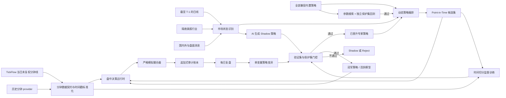

# AI 投资专家 Agent

AI 投资专家是一个仅用于模拟盘的分钟级 Agent。它不是固定运行某一个选股策略，而是在每个交易日使用上一交易日及更早的数据、隔夜美股行业表现和消息面识别市场状态，再从全部兼容的内置策略及已通过门控的专家生成策略中动态编排当日策略组合。盘中读取 TickFlow 当日分钟 K，训练和回测优先读取 TickFlow 历史分钟数据；目标窗口超出 TickFlow 能力时，自动用公开 Hugging Face A 股分钟归档补足较早区间，并在收盘后基于可审计结果进行训练或策略进化。

> 本模块不包含实盘券商接口，也不会发送真实委托。任何模型或进化策略都不能修改风控宪法。

## 架构



主要实现位置：

- `backend/app/paper_agent/`：数据集、训练、运行时、撮合、进化与 SQLite 审计存储。
- `backend/app/services/investment_expert.py`：交易日生命周期和低人工干预调度。
- `backend/app/api/investment_expert.py`：管理 API。
- `frontend/src/pages/InvestmentExpert.tsx`：运行、数据、训练和进化控制台。

## 动态策略编排与策略实验室

每天准备模拟会话时，投资专家会执行以下流程：

1. 仅使用截至 `T-1` 的市场宽度、20 日动量和波动率，并融合隔夜美股行业倾向及带置信度的消息面评分，将当日识别为进攻、防御、高波动或均衡状态。
2. 枚举策略引擎中全部支持 `stock + 1d` 的内置策略，以及已经通过独立保护集门控的专家生成策略。未晋升的 AI 策略不会参与交易候选。
3. 按市场状态计算适配度，选出不超过 8 个当日活跃策略并归一化权重。各策略独立运行；单个策略异常只会被隔离并记录，不影响基础候选和其他策略。
4. 将多策略命中按权重形成共识分，与原有动量、流动性、隔夜行业和消息面因子共同排序。市场状态、所有被考虑策略、实际分配、命中数、异常及参数版本均写入会话审计快照。

控制台的“优化策略参数”会对当前编排中的内置策略逐个执行参数网格搜索。搜索窗口与最近 90 天保护窗口严格分离；候选必须满足保护集交易数、扣费后单笔期望、总收益和最大回撤门槛才会晋升。优化不会改写内置策略源码，而是生成不可变参数版本；未通过版本仍保留用于审计，但不会替换当前有效参数。

“生成专家策略”会让当前 AI Provider 根据最新市场状态、策略命中与既往实验结果生成一个新的专家策略。生成代码必须通过 AST/元数据安全校验，只能使用项目策略契约，并至少提供一个可优化数值参数；系统先在训练窗口搜索参数，再以完全分离的最近一年保护集回测。只有交易样本、期望、收益与回撤全部达标才会晋升并进入后续每日编排；AI 未配置、代码无效或保护集不合格时不会进入交易候选。

### 尾盘首阳·10分钟 MA5 拐头

该内置策略把日线准备信号与盘中确认分开，避免使用尚未完成的数据：

1. `T-1` 收盘后只用已完成日线筛出连续收阴或平盘的弱势准备池；策略被当日动态编排选中且成为标的主策略时，才接管该标的的入场规则。
2. 交易日 `14:30`、`14:40`、`14:50` 使用已经完成的 10 分钟 K 线检查 MA5 是否由不升转为上扬，同时要求当日收红、相对前收达到最低涨幅并处于涨幅排名上限内。
3. 实时排名口径是 AI 投资专家当日实际候选池，历史回测口径是同一时点的策略准备池；当前不会把该排名表述成全市场实时涨幅榜。排名口径写入回放统计，便于审计。
4. 入场信号在检查分钟结束后才成立，按下一分钟未复权开盘价模拟成交。次日早盘依次执行止损、止盈、启动后的高点回撤和 `11:25` 超时退出，也按下一分钟开盘价成交；若次日数据中断，最迟在第 2 个交易日强制退出。
5. 该策略单独使用 1–2 个交易日持仓限制；其他内置策略和 AI 生成策略继续遵守普通的 3–15 个交易日限制。所有阈值均可进入训练窗参数搜索和独立保护集回测，分钟数据不足时按 fail-closed 处理，不生成伪成交。

## 防作弊与成交契约

系统采用 fail-closed 语义：无法证明数据当时已经可用时，不交易。

1. 候选集在日期 `T` 收盘后计算，只能从下一个已观察交易日开始使用，始终满足 `source_date < trade_date`。
2. 分钟 K 线的时间戳代表该分钟开始时间；特征要到 `bar_time + 1 minute` 才可用。
3. 信号不能在本分钟成交。撮合价为下一条合法分钟线的未复权 `raw_open`，并施加不利方向滑点。
4. 迟到超过 90 秒、乱序、不完整或缺失的分钟线被拒绝，不补价、不插值、不回放补买。
5. 强制 A 股 T+1、100 股整手、佣金最低收费、卖出印花税、成交量参与率、仓位和总敞口限制。
6. 持仓周期按每笔买入批次和上交所交易日历计算。普通止盈、VWAP、策略退出在满 3 个交易日前被抑制；满 15 个交易日的批次触发最长持有期退出。“尾盘首阳·10分钟MA5拐头”是显式策略例外，持有 1–2 个交易日。卖出继续按 FIFO 撮合，未到期的较新批次不会被最长持有期订单一并卖出。
7. 硬止损和系统级风险熔断属于紧急保护，可以突破最短持有期；最长 15 个交易日不能覆盖停牌、跌停或无流动性等客观不可成交状态。
8. 一字涨停不买，一字跌停或停牌不卖；无法成交的卖单保持阻塞状态，绝不假设成交。
9. 特征快照、决策、订单事件、组合快照、策略版本、模型版本及晋升/回滚事件均持久化。

## 三年样本与训练

在「AI 投资专家」页面选择 1–5 年并点击“构建 N 年历史样本”后，后台会：

1. 检查本地日线覆盖范围；能力允许时通过 TickFlow 向前补齐所需日线。
2. 为每个交易日生成 Point-in-Time 候选，使用 20 日动量、成交额排名，并在实时候选中融合现有趋势/突破/量价策略的一致性得分。
3. 按数据能力下载历史未复权分钟线：TickFlow 能覆盖的区间直接使用 TickFlow；更早或 TickFlow 无分钟权限的区间，从 `neigezhu/china-a-share-1min-ohlcv` 按候选证券和日期批量读取。日期 `T` 的分钟分区还包含 `T-1` 候选，以支持合法的跨日卖出与 T+1 标签。
4. 按日期分区写入 Parquet；已完成分区会跳过，因此任务可断点续跑。
5. 构造固定决策截点样本：特征截至 10:01 可用，下一分钟开盘模拟买入，下一交易日 09:31 分钟开盘模拟卖出，并扣除费用和滑点。
6. 按交易日期做 70%/15%/15% 的训练、验证、保护集切分。模型只使用训练集拟合标准化参数。
7. 只有验证集和保护集的 Brier 分数、样本量及扣费后入选期望同时通过门控，模型才会晋升；否则保留为未启用版本。

训练模型是入场概率门控器：它只能否决规则策略给出的买入，不能越权买入、扩大仓位或改变成交规则。没有通过门控的模型时，系统自动使用规则基线。

训练文件默认位于：

```text
<data_dir>/user_data/investment_expert/training/
  manifest.json
  candidates/date=YYYY-MM-DD/part.parquet
  minute/date=YYYY-MM-DD/part.parquet
```

审计数据库默认位于：

```text
<data_dir>/user_data/investment_expert_agent.db
```

## 每日生命周期

- 09:15 后：创建当日模拟会话并使用截至上一交易日的数据确定候选。
- 09:30–11:30、13:00–15:00：每 10 秒检查新完成分钟线。若服务在盘中才启动，只从启动前最近一个完整分钟开始，不回放早盘信号。
- 15:05 后：封存会话、生成复盘，并发起单变量策略变异。
- 进化阶段：冠军策略与候选策略在相同历史数据、相同活跃模型、相同撮合器下评估。存在数据/反作弊违规、成交样本不足、期望未改善、收益退化或回撤恶化时不得晋升。
- 风险阶段：日内权益损失达到 3% 或历史峰值回撤达到 15% 时，立即禁止新买入；盘后回滚最近一次执行规则、模型及策略参数晋升，并停用最近晋升的专家生成策略，跳过当天自动进化。若首个模型没有可回滚前代，则直接停用模型并退回规则基线；首个参数版本没有前代时则退回策略默认参数。卖出风险处理仍保持运行。

运行开关持久化。手动启动一次后，后端重启会恢复自动盯盘；手动停止会保持关闭。组合通过最近一次快照恢复，跨日持仓即使不在新候选池中也继续订阅分钟线以执行退出。

首次启用后若尚无成功的数据集，服务会在 15:05 后自动提交三年样本任务；盘中模拟交易拥有数据源优先级，历史分钟下载请求会被延后。当天自动任务失败后不会高频重试，下一交易日再自动尝试，也可在控制台手动重试。盘中 TickFlow 分钟能力或历史 provider 不可用时，对应任务会明确返回 `blocked`，不会启动一个持续报错的轮询器。

## 实时与历史分钟数据源

分钟数据拆成两条互不混用的链路：

- 盘中盯盘：优先调用 TickFlow `intraday.batch` 当日分K接口；当前套餐没有该能力时，明确降级到 TickFlow 历史分钟批量接口读取当日已完成分钟线。
- 训练与回测：优先使用「设置 -> 数据源」里选择的分钟 provider。历史源返回空日期、少于三根有效分钟线、缺少正常成交候选或混入其他日期时，任务立即失败，不写入伪完整分区。
- 当前 TickFlow Pro 官方覆盖为近一年分钟历史。请求更长窗口时，近一年仍由 TickFlow 提供，较早部分自动从 Hugging Face 的 [`neigezhu/china-a-share-1min-ohlcv`](https://huggingface.co/datasets/neigezhu/china-a-share-1min-ohlcv) 获取；若 TickFlow 完全没有分钟权限，则以公开归档的最新日期为样本终点向前取所选年限。
- Hugging Face 原始成交量单位为“股”，落入项目分钟契约前统一除以 100 转为“手”；价格保持未复权，`turnover` 映射为人民币成交额。归档本身存在已审计缺口，构建器只允许其 `no_bar_day_classification` 中明确标为分钟缺失的证券日跳过标签，不插值、不合成行情，其他缺口仍会使任务失败。
- 公开归档当前只覆盖 A 股股票，不替代盘中实时源，也不作为 ETF 或指数分钟数据源。实际范围以每次任务读取的 `metadata/summary.json` 为准，不在代码中硬编码快照日期；任务会记录并固定响应中的 Hub commit SHA，断点续跑不会混用不同快照。

## 从股票持仓继续模拟管理

AI 投资专家页面提供“同步我的持仓”入口，数据只来自项目本地的“股票持仓”模块，不连接券商，也不会发送真实委托。同步流程为：

1. 先停止 AI 投资专家盯盘，再打开同步预览。
2. 核对股票、数量、成本价、最新价、持仓日期以及将被替换的 AI 原持仓数量。
3. 明确确认后，以“股票持仓”为持仓真值覆盖 AI 原持仓；用户可填写实际可用现金，留空时按 0 处理，旧挂单全部清空。
4. 系统写入不可变的持仓同步事件及 payload hash，并以同步后的总权益建立新的回撤基线，避免历史模拟账户峰值导致错误熔断。
5. 重新启动盯盘后，同步持仓即使不在当日新候选池中，也会加入实时分钟订阅，继续执行止损、止盈、最长 15 个交易日和 VWAP 离场规则；普通退出仍须满足最少 3 个交易日，硬止损和系统风控除外；新买入继续遵守现金、仓位和风险宪法。

本地股票持仓当前不单独记录券商可用现金，因此同步确认框允许用户填写实际可用现金；未填写表示无可用资金，账户总权益只取当前持仓市值。持仓录入日期作为取得日期；当日新录入持仓仍受 A 股 T+1 约束。数量必须是当前执行器支持的整手数量，否则预览会阻止同步。

仓库提供可选的 `tushare_history` 插件。它只负责 A 股历史1分钟线，不接管实时行情。启用方式：

1. 在「设置 -> 数据源」安装 `Tushare 历史分钟` 插件依赖。
2. 设置环境变量 `TUSHARE_TOKEN`，并在 Tushare 单独开通“历史分钟”权限。
3. 重新加载数据源并选择 `tushare_history`；随后再构建三年样本。

Tushare 历史分钟数据仅限策略研究和学习使用。长区间按 20 个自然日分段，避免单次 8000 行上限截断。未配置 Token 或没有对应权限时保持不可用，不会静默回退到覆盖不足的源。

## 管理 API

| 方法 | 路径 | 用途 |
|---|---|---|
| GET | `/api/investment-expert/status` | 运行时、组合、数据集、冠军策略和活跃模型状态 |
| GET | `/api/investment-expert/portfolio-sync/preview` | 预览本地股票持仓、替换范围、当前 AI 现金参考和同步阻断原因 |
| POST | `/api/investment-expert/portfolio-sync` | 明确确认后覆盖 AI 持仓、清空挂单并建立新风控基线 |
| POST | `/api/investment-expert/runtime/start` | 持久化启用并启动模拟盯盘 |
| POST | `/api/investment-expert/runtime/stop` | 停止模拟盯盘 |
| POST | `/api/investment-expert/runtime/tick` | 管理员诊断：立即执行一次轮询 |
| POST | `/api/investment-expert/dataset/bootstrap` | 构建/续跑历史数据集；默认三年、每日 50 个候选 |
| POST | `/api/investment-expert/training/run` | 基于现有数据集重新训练并执行保护集门控 |
| POST | `/api/investment-expert/evolution/run` | 发起一次单变量策略进化实验 |
| POST | `/api/investment-expert/strategy/optimize` | 对当前编排中的内置策略执行训练窗参数搜索和独立保护集回测 |
| POST | `/api/investment-expert/strategy/generate` | 生成专家自有 Shadow 策略并执行安全校验与独立保护集门控 |
| GET | `/api/investment-expert/sessions` | 查询模拟盘会话 |
| GET | `/api/investment-expert/events` | 查询撮合与风控审计事件 |
| GET | `/api/investment-expert/trades` | 查询历史成交；卖出记录按标的和 T+1 规则 FIFO 配对买入记录 |
| GET | `/api/investment-expert/policies` | 查询不可变策略版本 |
| GET | `/api/investment-expert/models` | 查询不可变模型版本 |
| GET | `/api/investment-expert/experiments` | 查询进化实验与门控结果 |

这些接口沿用项目现有认证；普通成员默认不能访问新增的管理路径。

历史成交接口保留逐笔成交字段，并为卖出记录补充 `entry_price`、`exit_price`、买卖费用、扣费前后盈亏与收益率。`pnl_reason` 区分价格上涨覆盖成本、上涨但不足以覆盖成本、价格下跌并叠加成本、价格持平但被成本拖累等情况；买入和卖出的决策理由也会分别返回，供控制台解释为什么选股以及为什么退出。

## 运维注意事项

- 首次长年限分钟数据构建会产生较多网络请求与磁盘占用，耗时取决于候选数量、交易日数量、TickFlow 限流和 Hugging Face 下载速度。归档只读取候选证券涉及的行组，不下载完整 43GB 快照；任务在单独后台工作线程串行运行，不阻塞 API。
- 数据集任务和训练/进化任务互斥，重复请求会复用当前任务，避免同时写同一分区或争用资源。
- 历史 provider 返回空数据或覆盖不完整时不会生成虚构分区；修复权限或数据源后可从已有合法分区继续。
- 模拟绩效不代表未来实盘收益。胜率只作为一个观测指标，晋升同时约束扣费后期望、净收益、回撤和违规数。

## 验证

专项测试：

```powershell
cd backend
.\.venv\Scripts\python.exe -m pytest tests\paper_agent tests\test_tickflow_minute_provider.py -q
```

前端生产构建：

```powershell
cd frontend
pnpm run build
```
